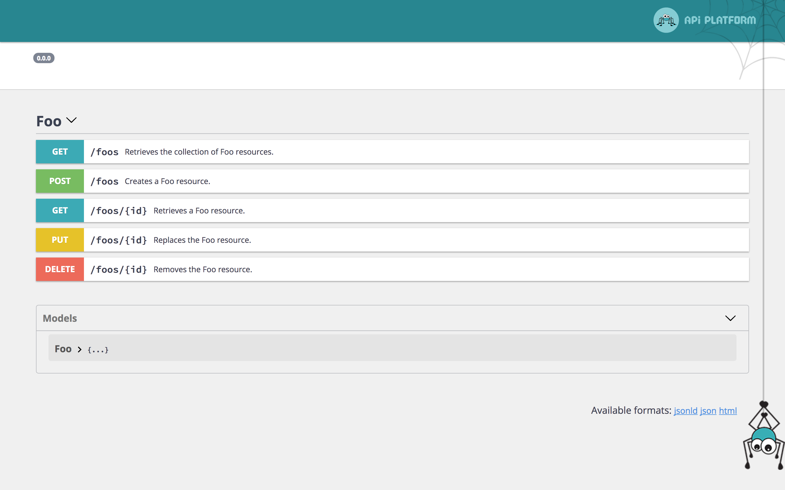

# The API Platform Core Library

API Platform Core is an easy to use and powerful library to create [hypermedia-driven REST APIs](http://en.wikipedia.org/wiki/HATEOAS).
It is a component of the [API Platform framework](https://api-platform.com). It can be used standalone or with [the Symfony
framework](https://symfony.com) (recommended).

It embraces [JSON for Linked Data (JSON-LD)](http://json-ld.org) and [Hydra Core Vocabulary](http://www.hydra-cg.com) web
standards but also supports [HAL](http://stateless.co/hal_specification.html), [Swagger/Open API](https://www.openapis.org/), XML, JSON, CSV and YAML.

Build a working and fully-featured CRUD API in minutes. Leverage the awesome features of the tool to develop complex and
high performance API-first projects.

If you are starting a new project, the easiest way to get API Platform up is to install
the [API Platform Distribution](../distribution/index.md).

## Features

Here is the fully-featured REST API you'll get in minutes:

* [Automatic CRUD](operations.md)
* Hypermedia (JSON-LD and HAL)
* Machine-readable documentation of the API in the Hydra and [Swagger/Open API](swagger.md) formats,
  guessed from PHPDoc, Serializer, Validator and Doctrine ORM metadata
* Nice human-readable documentation built with Swagger UI and including a sandbox
* [Pagination](pagination.md)
* A bunch of [filters](filters.md)
* [Ordering](default-order.md)
* [Validation](validation.md) using the Symfony Validator Component (with groups support)
* Advanced [authentication and authorization](security.md) rules
* Errors serialization (Hydra and the [RFC 7807](https://tools.ietf.org/html/rfc7807) are supported)
* Advanced [serialization](serialization.md) thanks to the Symfony Serializer Component (groups support, relation embedding, max depth...)
* Automatic routes registration
* Automatic entrypoint generation giving access to all resources
* [JWT](jwt.md) and [OAuth](https://oauth.net/) support
* Files and `\DateTime` and serialization and deserialization
* [FOSUserBundle](fosuser-bundle.md) integration (user management)

Everything is fully customizable through a powerful event system and strong OOP.
This library is extensively tested (unit and functional). The [`Fixtures/` directory](https://github.com/api-platform/core/tree/master/Fixtures))
contains a working app covering all features of the library.

## Other resources

* (english) [API Platform 2.1 Feature Walkthrough: Create Blazing Fast Hypermedia APIs, Generate JS Apps](https://dunglas.fr/2017/06/api-platform-2-1-feature-walkthrough-create-blazing-fast-hypermedia-apis-generate-js-apps/)
* (english) [Discovering API Platform v2](https://dunglas.fr/2016/05/the-first-alpha-of-api-platform-2-0-is-available/)
* (english) [Create API-First Web Apps with API Platform, a PHP Framework](http://blog.runscope.com/posts/create-api-first-web-apps-with-api-platform-a-php-framework)
* (french) [Tour d'horizon des changements dans API Platform v2](https://les-tilleuls.coop/fr/blog/article/la-premiere-alpha-d-api-platform-2-0-est-disponible)
* (french) [A la découverte de API Platform (Symfony Live Paris 2015)](https://dunglas.fr/2015/04/mes-slides-du-symfony-live-2015-a-la-decouverte-de-api-platform/)
* (french) [API-first et Linked Data avec Symfony (sfPot Lille 2015)](https://les-tilleuls.coop/slides/dunglas/slides-sfPot-2015-01-15/#/)
