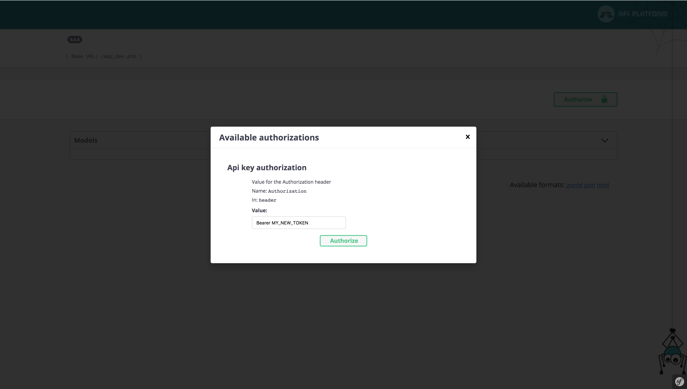

# JWT Authentication

> [JSON Web Token (JWT)](https://jwt.io/) is a JSON-based open standard ([RFC 7519](https://tools.ietf.org/html/rfc7519)) for creating access tokens that assert some number of claims. For example, a server could generate a token that has the claim "logged in as admin" and provide that to a client. The client could then use that token to prove that he/she is logged in as admin. The tokens are signed by the server's key, so the server is able to verify that the token is legitimate. The tokens are designed to be compact, URL-safe and usable especially in web browser single sign-on (SSO) context.
>
> ―[Wikipedia](https://en.wikipedia.org/wiki/JSON_Web_Token)

API Platform allows to easily add a JWT-based authentication to your API using [LexikJWTAuthenticationBundle](https://github.com/lexik/LexikJWTAuthenticationBundle).

<p align="center" class="symfonycasts"><a href="https://symfonycasts.com/screencast/symfony-rest4/json-web-token?cid=apip"><br>Watch the LexikJWTAuthenticationBundle screencast</a></p>

## Installing LexikJWTAuthenticationBundle

We begin by installing the bundle:

    $ docker-compose exec php composer require jwt-auth

Then we need to generate the public and private keys used for signing JWT tokens. If you're using the [API Platform distribution](../distribution/index.md), you may run this from the project's root directory:

    $ docker-compose exec php sh -c '
        set -e
        apk add openssl
        mkdir -p config/jwt
        jwt_passhrase=$(grep ''^JWT_PASSPHRASE='' .env | cut -f 2 -d ''='')
        echo "$jwt_passhrase" | openssl genpkey -out config/jwt/private.pem -pass stdin -aes256 -algorithm rsa -pkeyopt rsa_keygen_bits:4096
        echo "$jwt_passhrase" | openssl pkey -in config/jwt/private.pem -passin stdin -out config/jwt/public.pem -pubout
        setfacl -R -m u:www-data:rX -m u:"$(whoami)":rwX config/jwt
        setfacl -dR -m u:www-data:rX -m u:"$(whoami)":rwX config/jwt
    '

This takes care of using the correct passphrase to encrypt the private key, and setting the correct permissions on the
keys allowing the web server to read them.

If you want the keys to be auto generated in `dev` environment, see an example in the [docker-entrypoint script of api-platform/demo](https://github.com/api-platform/demo/blob/master/api/docker/php/docker-entrypoint.sh).

The keys should not be checked in to the repository (i.e. it's in `api/.gitignore`). However, note that a JWT token could
only pass signature validation against the same pair of keys it was signed with. This is especially relevant in a production
environment, where you don't want to accidentally invalidate all your clients' tokens at every deployment.

For more information, refer to [the bundle's documentation](https://github.com/lexik/LexikJWTAuthenticationBundle/blob/master/Resources/doc/index.md)
or read a [general introduction to JWT here](https://jwt.io/introduction/).

We're not done yet! Let's move on to configuring the Symfony SecurityBundle for JWT authentication.

## Configuring the Symfony SecurityBundle

It is necessary to configure a user provider. You can either use the [Doctrine entity user provider](https://symfony.com/doc/current/security/user_provider.html#entity-user-provider)
provided by Symfony (recommended), [create a custom user provider](https://symfony.com/doc/current/security/user_provider.html#creating-a-custom-user-provider)
or use [API Platform's FOSUserBundle integration](fosuser-bundle.md) (not recommended).

If you choose to use the Doctrine entity user provider, start by [creating your `User` class](https://symfony.com/doc/current/security.html#a-create-your-user-class).

Then update the security configuration:

```yaml
# api/config/packages/security.yaml
security:
    encoders:
        App\Entity\User:
            algorithm: argon2i

    # https://symfony.com/doc/current/security.html#where-do-users-come-from-user-providers
    providers:
        # used to reload user from session & other features (e.g. switch_user)
        app_user_provider:
            entity:
                class: App\Entity\User
                property: email

    firewalls:
        dev:
            pattern: ^/_(profiler|wdt)
            security: false
        main:
            stateless: true
            anonymous: true
            provider: app_user_provider
            json_login:
                check_path: /authentication_token
                username_path: email
                password_path: password
                success_handler: lexik_jwt_authentication.handler.authentication_success
                failure_handler: lexik_jwt_authentication.handler.authentication_failure
            guard:
                authenticators:
                    - lexik_jwt_authentication.jwt_token_authenticator
```

You must also declare the route used for `/authentication_token`:

```yaml
# api/config/routes.yaml
authentication_token:
    path: /authentication_token
    methods: ['POST']
```

If you want to avoid loading the `User` entity from database each time a JWT token needs to be authenticated, you may consider using
the [database-less user provider](https://github.com/lexik/LexikJWTAuthenticationBundle/blob/master/Resources/doc/8-jwt-user-provider.md) provided by LexikJWTAuthenticationBundle. However, it means you will have to fetch the `User` entity from the database yourself as needed (probably through the Doctrine EntityManager).

Refer to the section on [Security](security.md) to learn how to control access to API resources and operations. You may
also want to [configure Swagger UI for JWT authentication](#documenting-the-authentication-mechanism-with-swaggeropen-api).

### Adding Authentication to an API Which Uses a Path Prefix

If your API uses a [path prefix](https://symfony.com/doc/current/routing/external_resources.html#prefixing-the-urls-of-imported-routes), the security configuration would look something like this instead:

```yaml
# api/config/packages/security.yaml
security:
    encoders:
        App\Entity\User:
            algorithm: argon2i

    # https://symfony.com/doc/current/security.html#where-do-users-come-from-user-providers
    providers:
        # used to reload user from session & other features (e.g. switch_user)
        app_user_provider:
            entity:
                class: App\Entity\User
                property: email

    firewalls:
        dev:
            pattern: ^/_(profiler|wdt)
            security: false
        api:
            pattern: ^/api/
            stateless: true
            anonymous: true
            provider: app_user_provider
            guard:
                authenticators:
                    - lexik_jwt_authentication.jwt_token_authenticator
        main:
            anonymous: true
            json_login:
                check_path: /authentication_token
                username_path: email
                password_path: password
                success_handler: lexik_jwt_authentication.handler.authentication_success
                failure_handler: lexik_jwt_authentication.handler.authentication_failure
```

## Documenting the Authentication Mechanism with Swagger/Open API

Want to test the routes of your JWT-authentication-protected API?

### Configuring API Platform

```yaml
# api/config/packages/api_platform.yaml
api_platform:
    swagger:
         api_keys:
             apiKey:
                name: Authorization
                type: header
```

The "Authorize" button will automatically appear in Swagger UI.


### Adding a New API Key

All you have to do is configure the API key in the `value` field.
By default, [only the authorization header mode is enabled](https://github.com/lexik/LexikJWTAuthenticationBundle/blob/master/Resources/doc/index.md#2-use-the-token) in LexikJWTAuthenticationBundle.
You must set the [JWT token](https://github.com/lexik/LexikJWTAuthenticationBundle/blob/master/Resources/doc/index.md#1-obtain-the-token) as below and click on the "Authorize" button.

```
Bearer MY_NEW_TOKEN
```



## Testing with Behat

Let's configure Behat to automatically send an `Authorization` HTTP header containing a valid JWT token when a scenario is marked with a `@login` annotation. Edit `features/bootstrap/FeatureContext.php` and add the following methods:

```php
<?php
// features/bootstrap/FeatureContext.php

use App\Entity\User;
use Behat\Behat\Hook\Scope\BeforeScenarioScope;
use Behatch\Context\RestContext;

class FeatureContext implements Context, SnippetAcceptingContext
{
    // ...
    // Must be after createDatabase() and dropDatabase() functions (the order matters)

    /**
     * @BeforeScenario
     * @login
     *
     * @see https://symfony.com/doc/current/security/entity_provider.html#creating-your-first-user
     */
    public function login(BeforeScenarioScope $scope)
    {
        $user = new User();
        $user->setUsername('admin');
        $user->setPassword('ATestPassword');
        $user->setEmail('test@test.com');

        $this->manager->persist($user);
        $this->manager->flush();

        $token = $this->jwtManager->create($user);

        $this->restContext = $scope->getEnvironment()->getContext(RestContext::class);
        $this->restContext->iAddHeaderEqualTo('Authorization', "Bearer $token");
    }

    /**
     * @AfterScenario
     * @logout
     */
    public function logout() {
        $this->restContext->iAddHeaderEqualTo('Authorization', '');
    }
}
```

Then, update `behat.yml` to inject the `lexik_jwt_authentication.jwt_manager`:

```yaml
# behat.yml
default:
  # ...
  suites:
    default:
      contexts:
        - FeatureContext: { doctrine: '@doctrine', 'jwtManager': '@lexik_jwt_authentication.jwt_manager' }
        - Behat\MinkExtension\Context\MinkContext
        - Behatch\Context\RestContext
        - Behatch\Context\JsonContext
  # ...
```

Finally, mark your scenarios with the `@login` annotation to automatically add a valid `Authorization` header, and with `@logout` to be sure to destroy the token after this scenario.
